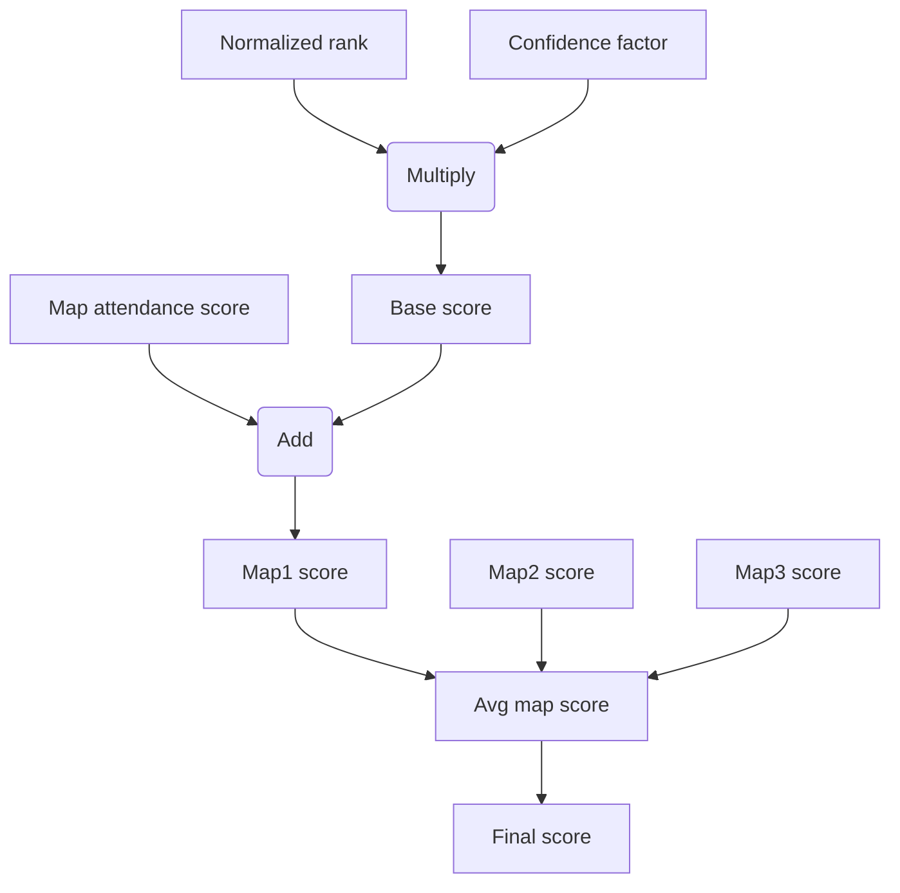

# QuickQuack [](https://opensource.org/licenses/MIT)
The ~~Fast Duck~~ QuickQuack skill rating system is specifically designed for time-based games, such as racing games, where players strive to achieve the fastest completion times on various maps or tracks.

Time-based games like racing games pose unique challenges in rating calculations compared to more common competitive games such as chess or MOBA games. In these games, there are finite "matches" where results cannot be altered after they are completed. However, in racing games, maps are typically accessible throughout the lifespan of the game, allowing for the setting of new records.

Another distinction is that players in racing games are not directly competing with each other; instead, they are competing against the map itself, and the winner is the one who completes it most effectively. Therefore, to measure a player's skill against a given map, we need to understand its relative difficulty and quality, which requires a substantial number of players attempting the map. The more players attempt a map, the more "saturated" it becomes. It's also worth highlighting that even attempting a map, without necessarily completing it, contributes to its saturation, particularly if the map is exceedingly challenging.

Furthermore, racing games often feature numerous maps, ranging from hundreds to thousands. Ensuring proper saturation for all of them is likely impossible due to several reasons:
  - Low player base
  - Fluctuations in the player base over time, leading to changes in overall "player skill"
  - Not all maps are equally popular or joyfull to play
  - Some maps may be too difficult to complete even once
  - Player preferences for longer or shorter maps, or maps that test specific skill sets
  - New players are more inclined to play newer maps rather than older ones

So, how does QuickQuack attempt to address these challenges? In short, through seasonal rotations with predetermined map pools. The seasonal approach restricts calculations to specific timeframes and map selections, enhancing their "local" accuracy. Additionally, players like competitions, and seasons with fixed map selections encourage them to play those maps, resulting in proper map saturation.

For more details check "Key Principles" section.
If you don't want to use the seasonal approach, refer to the section "How to make it work outside defined seasons."

# Key Principles
Here are key principles and ideas QuickQuack was designed around:

* Every season should start as a clean slate. Maps selected for given season should be traeated as without any existing records on them (but of course top, rank 1 time for given map should be saved in some global timetable).
* Players ratings from previous seasons should not be relevant.
* The season's map pool should be a subset of all maps available in game. Maps for a pool can be either handpicked, semi-random, or chosen through community votes. Pool could also include new maps, specifically released for a particular season.
* The duration of the season and the size of the map pool should be coordinated to ensure that even casual players can attempt every map. For example, 30 days and 20 maps.
* To receive a rating for the given season, players must successfully complete a minimal number of maps from the pool (e.g. if map pool size is 20, then minimum number of maps to complete can be 10).
* Players should not avoid playing more maps than the required minimum out of fear of lowering their final score.
* To maximize map saturation, the rating system should encourage players to play maps that have a low record count.
* If a player has sufficient skill, they should be able to win the season by participating in only the required number of maps. The system should not award more points simply because a player completed additional maps.

# Calculations
The QuickQuack algorithm is fairly straightforward and can be explained in a few steps, each outlining the calculations behind one of its key components.

Flowchart with simplified steps to grasp the overall concept:


## Components used to calculate final score:
Notes:
1. **Total season participators** represents how many players completed at least one map from season's map pool. From now on lets abbreviate it to `total_participators`.
2. Player must complete at least some amount of maps before getting season rating. Lets call this number a `map_required`.
3. This algorithm uses normalization in a form of remapping value from one range to another. In further description I will use remapping function with such signature:
```python
remap(value_to_remap, input_range_start, input_range_stop, output_range_start, output_range_stop)
```

### Normalized rank
The normalized ranking offers a richer set of information compared to the traditional ranking. While the classical ranking focuses solely on the order of sorted records, the normalized ranking goes further by conveying the actual differences between times (map records).

```python
normalized_rank = remap(player_time_on_map, best_map_time, worst_map_time, 1000, 0)
```

### Confidence factor
The confidence factor reflects how a specific time on a map is 'good' compared to other times. If there is only one record on a map, there is no competition, and in such a case, no points are awarded. This is balanced out by the `attendance_score` component described later.

This component is calculated from number of records given record defeated, or in another words "number of opponents behind". 
```python
confidence_factor = remap(num_opponents_behind, 0, total_participators - 1, 0, 1)
```

### Base score
```python
base_score = normalized_rank * confidence_factor
```

### Attendance score  
This component serves two primary objectives:
1. Levels the base score if it is low due to a limited number of records on a given map.
2. Motivates players to play maps with low record count, addressing the "saturation" issue.

It's important to note that this is unrelated to the `base_score` and all players on a given map will receive the same amount of `attendance_score`.
```python
attendance_score = remap(total_num_records_on_map, 1, total_participators, 1000, 0)
```

### Map score
```python
map_score = base_score + attendance_score
```

### Average map score
Average map score is calculated only from `map_required` maps on which player performed the best. So after each new record done by a player, list with every `map_score` done by a player is sorted and only best are taken to calculate an average.

This is to prevent players from avoiding playing more maps than required in fear of lowering their `final_score`.
```python
avg_map_score = sum_of_best_map_scores / map_required
```

### Final score
This is the final skill measure and should be used to create season's leader board.
If player has records on at least `map_required` maps then it is `avg_map_score`, otherwise: `0`.
```python
if player_number_of_records >= map_required:
  final_score = avg_map_score
else:
  final_score = 0
```

# Potential Drawbacks
1. Whenever a new player joins the season, we need to redo all the calculations for every record on every map and update the stats for each player. Additionally, player stats must be recalculated whenever a new record is set on a map in which the player participated. Without proper optimization, this could be computationally intensive. But there's a simple solution - instead of running calculations every time there's a new player or record, do it, for example, once every 10 minutes; super up-to-date stats are not critical.
2. Final score has reachable upper bound (1000 with settings described in "calculation" section). It is very uncommon though.
3. It's possible for two players to have the exact same final score. However, the probability of this happening is extremely low, and it decreases even further with more players, maps, and records.

# How to implement QuickQuack into your game?
To seamlessly integrate the QuickQuack skill rating system into your game, follow these minimal required steps:

1. **Define Season Duration and Rest Days**: Determine the duration of each season and decide if there will be any "rest days" between consecutive seasons.
2. **Establish Map Pool Size**: Decide on the size of the map pool to be featured in each season.
3. **Set Minimum Number of Maps for Rating**: Determine the minimum number of maps a player must complete to receive a rating at the end of the season.
4. **Select Maps for Seasonal Map Pool**: Choose the maps to include in the map pool for each season, ensuring diversity and challenge.
5. **Integrate QuickQuack Algorithm**: Implement the QuickQuack algorithm into your game system.
6. **Provide Leaderboard Access**: Create a means for players to access both overall and map-specific leaderboards, allowing them to track their progress and compare their performance with others.

While these steps represent the essential foundation for implementing QuickQuack, there's plenty of room for further enhancements and adjustments. Explore the "Additional Ideas" and "How to Make It Work Outside Defined Seasons" sections for additional inspiration and customization options.

# Sample Implementation
This repository includes a proof-of-concept sample implementation of the system. It is important to note that this implementation is heavily unoptimized and should not be utilized in a production environment.
While there is some boilerplate code, those interested in understanding the QuickQuack implementation can begin by reviewing the `add_record` method. 
In addition, there are methods to dump and load JSON files, making it easy to inspect numbers in the database.
There is also a `populate_database` method designed to simulate "real-world" data, although it is a big approximation. This simulation involves randomly set parameters such as:
* Map popularity
* Absolute player skill
* Player skill uncertainty
* Player number of tries for each map

This approach allows for the comparison of "expected results" with the "actual results" produced by QuickQuack. Following several tests, I can confirmed that QuickQuack is indeed working and yields the intended outcomes 😄.

To test that script simply run `python main.py`.

# Additional Ideas
* At the conclusion of each season, players could be awarded "badges" for achieving specific milestones, such as securing 1st, 2nd, and 3rd place on individual maps and on final leaderboard. An additional achievement might be earned for recording a time on every map in the pool. Many other achievements could be explored. The key aspect is visibility of those badges, they should be displayed in a player's profile as attractive graphical icons, serving as strong motivation to participate in the season.
* Historical season results should be easily accessible, everyone loves statistics!

# How to make it work outside defined seasons
In order to implement the system outside defined seasons, a straightforward approach is to assign each player their individual map pool, consisting of the X number of maps where the player performed the best (of course, there will be other adjustments to make). However, it's important to note that calculating skill ratings across thousands of maps, over an infinite time period, and with numerous inactive players will result in less accuracy compared to restricting the system to specific defined values and active players only.

I would recommend avoiding the use of just one long-term rating. Perhaps a good solution would be to have two ratings: the first being short-term and accurate, and the second being long-term and approximate. The long-term rating can be calculated using the above approach or simply be the average of all (or just the latest) short-term ratings.

# License
[MIT](LICENSE)
