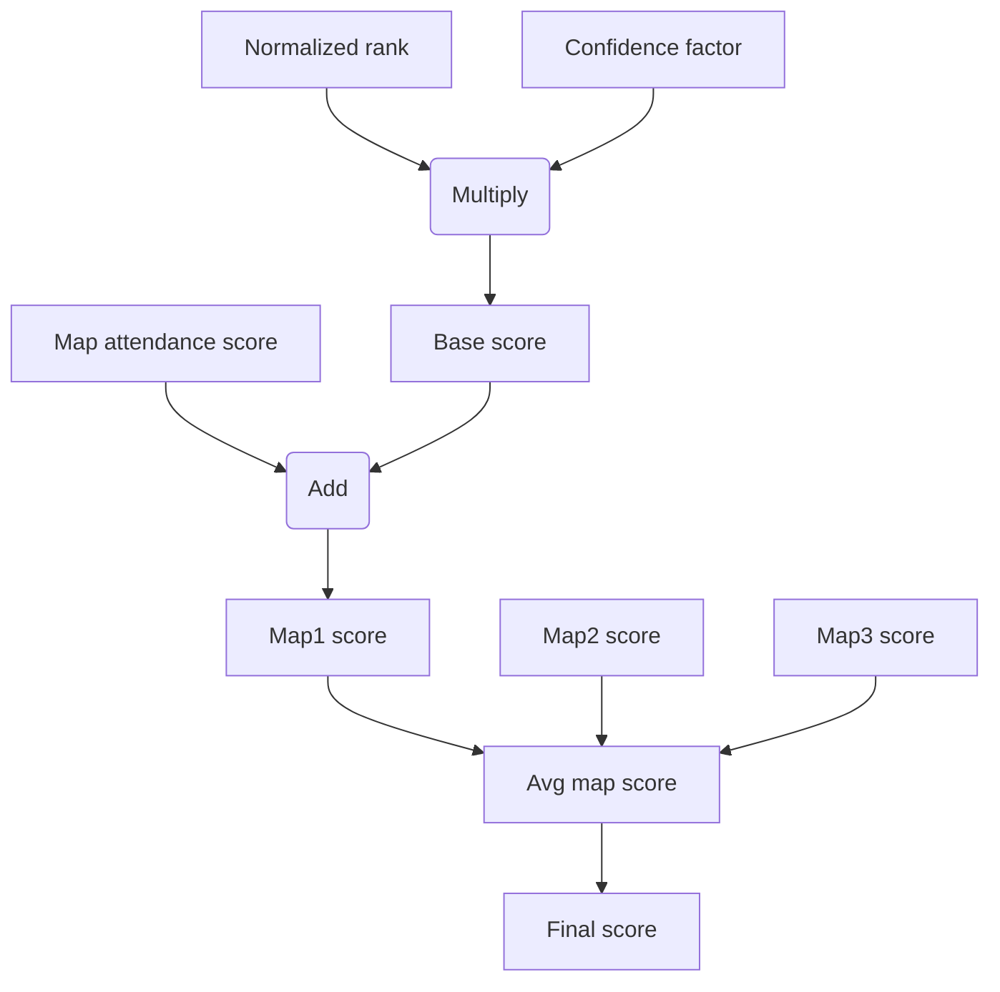

**NOTICE** 

QuickQuack is in the development phase and some key principles and / or calculations may change as I am atill testing some ideas.

# QuickQuack 
The ~~Fast Duck~~ QuickQuack skill rating system is specifically designed for time-based games, such as racing games, where players strive to achieve the fastest completion times on various maps. It addresses key challenges commonly encountered in such games:
* Many time-based games feature a large number of maps, ranging from hundreds to thousands. This can result in situations where a map lacks sufficient "saturation" to provide a balanced rating for players who complete it. Factors contributing to this lack of "saturation" may include a low player base, the map's lack of popularity, or its high level of difficulty, making successful completion a significant challenge.
* Time-based games typically operate as "infinite games," allowing continual access to maps throughout the game's lifespan and enabling ongoing alterations to leaderboards.

# Key Principles
* The rating system should be designed around seasons and a predefined map pool for each respective season (this is to address challenges listed above).
* Individual player skill rating should always be relative to all other players participating in a given season.
* Seasons should have a relatively short duration, allowing even casual players to actively participate from start to finish (e.g., 2 weeks).
* The map pool should not be overly extensive to ensure that even casual players can engage with all the maps within the given time period (e.g., number of maps same as number of days in a season). Additionally, the map pool should encompass maps that test a variety of skills.
* To receive a rating for the given season, players must successfully complete a specified number of maps from the pool (e.g., the number of maps in the pool multiplied by 0.5). Times recorded outside given season time frame should not be considered.
* Players should not avoid playing more maps than the required minimum out of fear of lowering their final score.
* To maximize map saturation, the rating system should encourage players to play maps that have a low record count. It's worth noting here that map saturation is achieved when players try to complete it, even if ultimately they won't have any record on it.
* If a player has sufficient skill, they should be able to win the season by participating in only the required number of maps. The system should not award more points simply because a player completed additional maps.
* For the season's final rating to be compatible with any future seasons, it is important to normalize the number of players, maps, and records.

If you need "no seasonal approach" check section "How to make it work outside defined seasons".

# Calculations
The QuickQuack algorithm is fairly straightforward and can be explained in a few steps, each outlining the calculations behind one of its key components.

Flowchart with simplified steps to grasp the overall concept:

Main components used to calculate final score:
* **normalized_rank**: player’s time normalized from `<best_map_time, worst_map_time>` to `<1000, 0>`, calculated per player, per map
* **confidence_factor**:  number of opponents behind on given map normalized from `<0, total_participating_players_count_in_whole_season - 1>` to `<0, 1>`, calculated per player, per map
* **base_score**: `normalized_rank * confidence_factor`, calculated per player, per map
* **attendance_score**: total number of records on given map normalized from `<1, total_participating_players_count_in_whole_season>` to `<1000, 0>`, calculated per map
* **map_score**: `base_score + attendance_score`, calculated per player, per map
* **avg_map_score**: `map_score_sum_from_all_maps_player_finished / number_of_all_maps_player_finished`, calculated per player
* **final_score**: if player completed minimum require number of maps it is `avg_map_score` otherwise: `0`, calculated per player

# Sample Implementation
This repository includes a proof-of-concept sample implementation of the system. It is important to note that this implementation is heavily unoptimized and should not be utilized in a production environment.
While there is some boilerplate code, those interested in understanding the QuickQuack implementation can begin by reviewing the `add_record` method. 
In addition, there are methods to dump and load JSON files, making it easy to inspect numbers in the database.
There is also a `populate_database` method designed to simulate "real-world" data, although it is an big approximation. This simulation involves randomly set parameters such as:
* Map popularity
* Absolute player skill
* Player skill uncertainty
* Player number of tries for each map

This approach allows for the comparison of "expected results" with the "actual results" produced by QuickQuack. Following several tests, I can confirmed that QuickQuack is indeed working and yields the intended outcomes 😄.

To test that script simply run `python main.py`.

# Additional Ideas
* The map pool selection can be customized, either handpicked, semi-random, or chosen through community votes. It could also include new maps specifically released for a particular season.
* At the conclusion of each season, players could be awarded "badges" for achieving specific milestones, such as securing 1st, 2nd, and 3rd place on individual maps and on final leaderboard. An additional achievement might be earned for recording a time on every map in the pool. Many other achievements could be explored. The key aspect is visibility of those badges, they should be displayed in a player's profile as attractive graphical icons, serving as strong motivation to participate in the season.
* Historical season results should be easily accessible, everyone loves statistics!

# How to make it work outside defined seasons
In order to implement the system outside defined seasons, a straightforward approach is to assign each player their individual map pool, consisting of the X number of maps where the player performed the best (of course, there will be other adjustments to make). However, it's important to note that calculating skill ratings across thousands of maps, over an infinite time period, and with numerous inactive players will result in less accuracy compared to restricting the system to specific defined values and active players only.

I would recommend avoiding the use of just one long-term rating. Perhaps a good solution would be to have two ratings: the first being short-term and accurate, and the second being long-term and approximate. The long-term rating can be calculated using the above approach or simply be the average of all (or just the latest) short-term ratings.

# License
[MIT](LICENSE)
